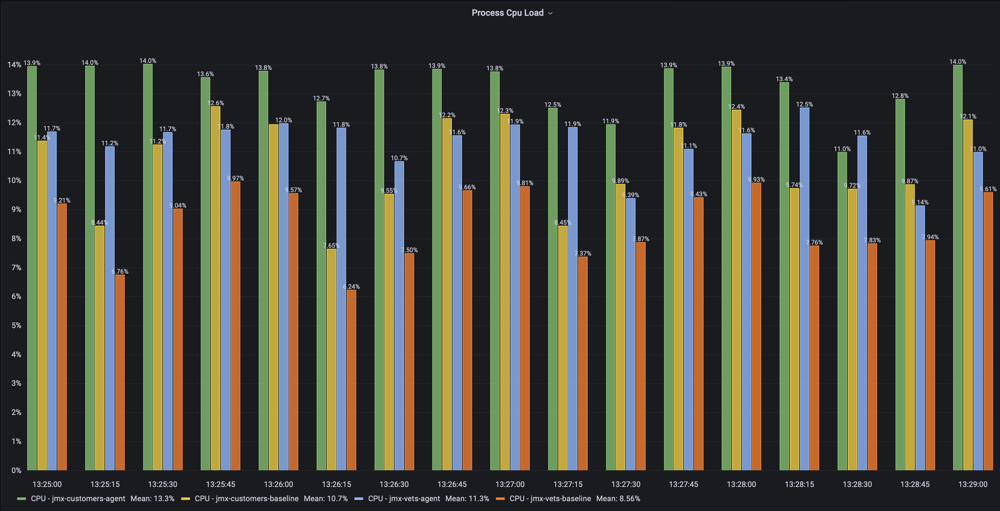
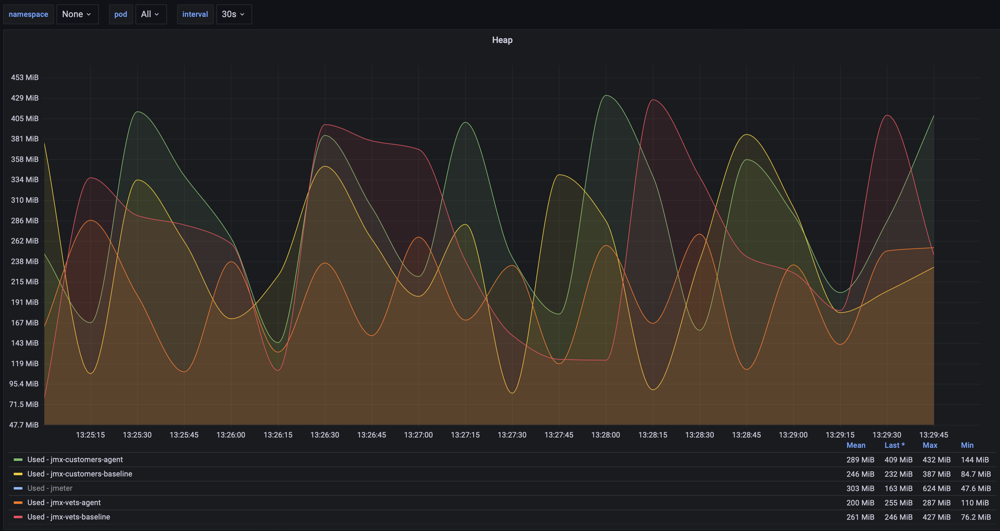
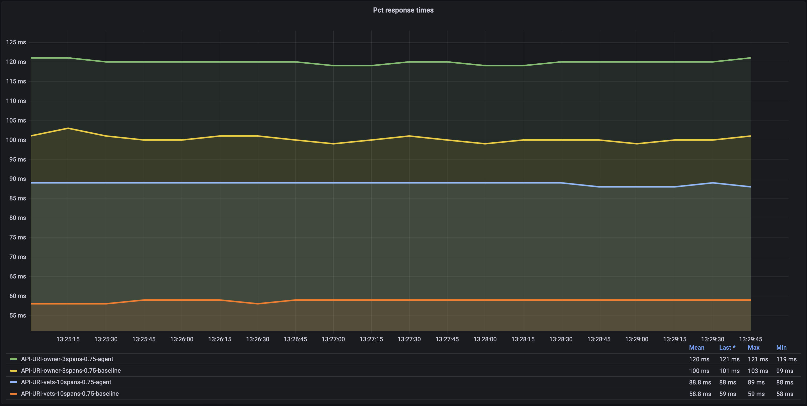
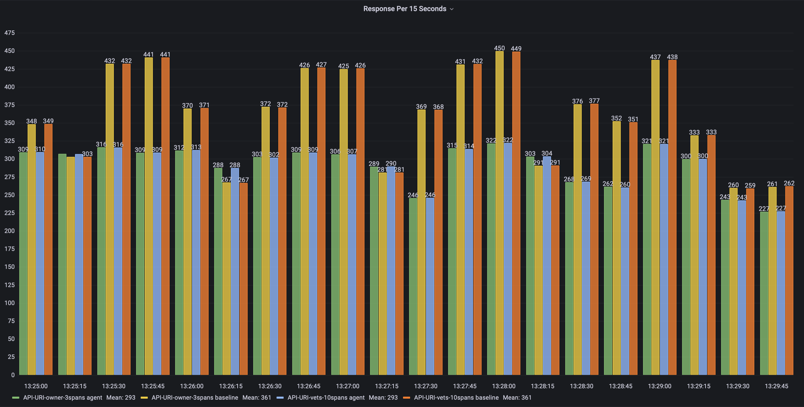
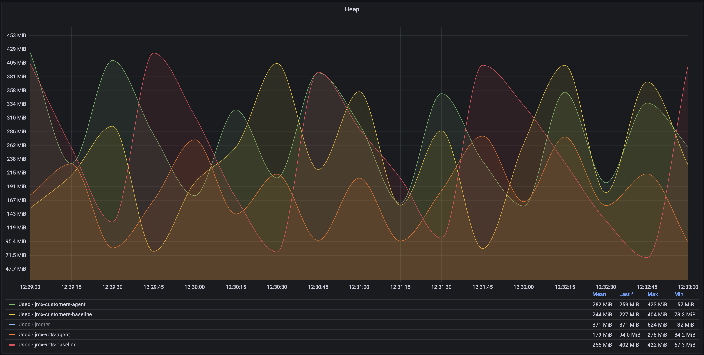
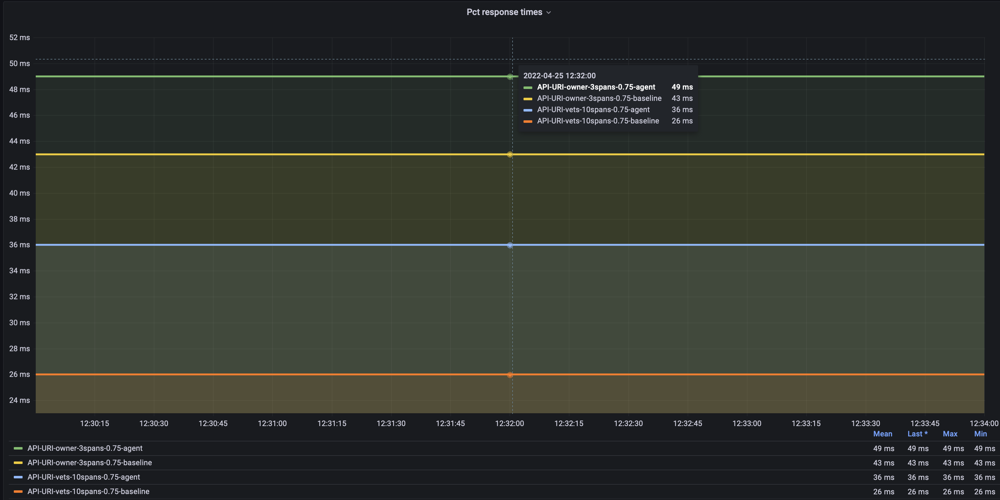
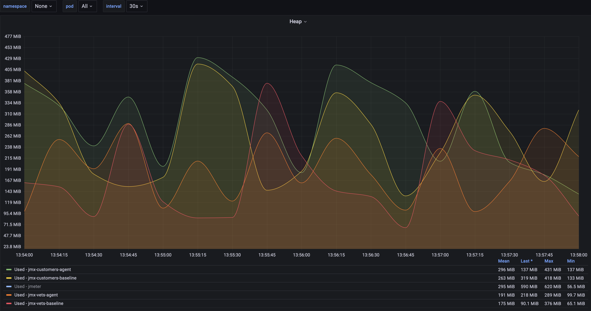
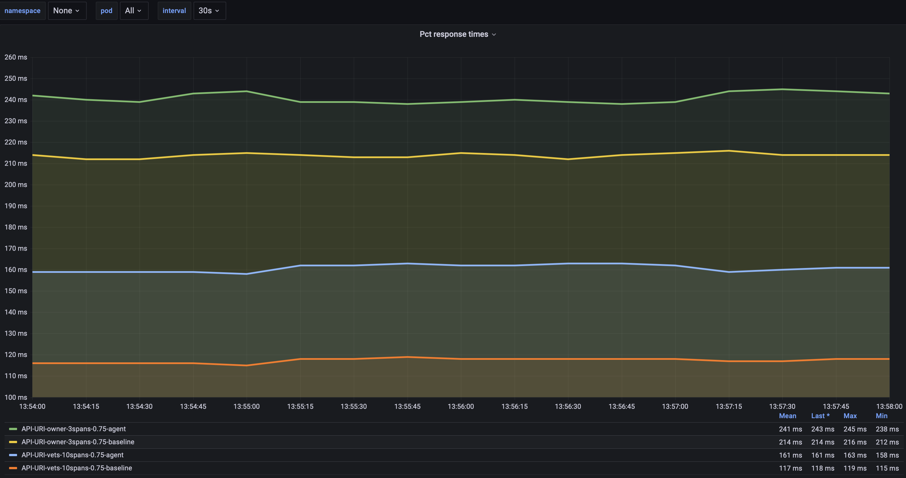

# Benchmark
We use [spring-petclinic applications](https://github.com/spring-petclinic/spring-petclinic-microservices) as the benchmark application because it is relatively close to the real user scenario.

We use three AWS EC2 machines in a subnet for the benchmark test:

- Baseline EC2: run the application stack without Easeagent.
- Agent EC2: run the application with Easeagent.
- Tester EC2: we initiate testing requests and collect testing metric data on this node.

We run Jmeter on `Tester` node to start two identical thread groups to access the `Baseline` node and `Agent` node at the same time, and collect the metric data.

All three AWS EC2 machines have the exact same configuration, and in a subnet:
```
CPU: 2 cores, Intel(R) Xeon(R) Platinum 8175M CPU @ 2.50GHz
MEM: 7850092 kB
SSD: XFS 100G

OS: CentOS Linux release 8.5.2111
Docker version 20.10.14, build a224086
docker-compose version 1.27.4, build 40524192
```


## Test Result

The following two URIs which we use to test:
- API-URI-owner-3spans: /api/gateway/owners/2
- API-URI-vets-10spans: /api/vet/vets

These two URIs generate 3 and 10 SPANs respectively, and by comparing the resource utilization metrics, the impact of the number of SPANs can be observed.

For each value pair in the table, the former is the baseline value and the latter is the agent value (baseline / agent / difference value).

### 10 threads groups 

| URI-Label                | CPU (baseline/agent/diff) | Heap Memory        | P75 Latency               | Throughput (15s) |
|----------------------|:--------------------------|:-------------------|:--------------------------|------------------|
| API-URI-owner-3spans | 10.7% / 13.3% / 2.5%      | 246M / 289M / 43M  | 100ms  / 120ms  / 20ms    | 361 / 293 / -68  |
| API-URI-vets-10spans | 8.56% / 11.3% / 2.64%     | 261M / 200M / -61M | 58.8ms / 88.8ms / 30ms    | 361 / 293 / -68  |

#### Diagram of 10 Threads Groups 
- CPU


- Heap


- Lagency & Throuthput




### 20 threads groups 

| URI-Label                | CPU (baseline/agent/diff) | Heap Memory        | P75 Latency               | Throughput (15s) |
|----------------------|:--------------------------|:-------------------|:--------------------------|------------------|
| API-URI-owner-3spans | 10.0% / 12.8% / 2.8%      | 244M / 282M / 38M  | 43ms / 49ms / 6ms         | 332 / 277 / -55  |
| API-URI-vets-10spans | 8.43% / 11.0% / 2.57%     | 179M / 255M / -71M | 26ms / 36ms / 10ms        | 332 / 277 / -55  |

#### Diagram of 20 Threads Groups 
- CPU


- Heap


- Lagency & Throuthput



### 50 threads groups 

| URI-Label                | CPU (baseline/agent/diff) | Heap Memory        | P75 Latency               | Throughput (15s) |
|----------------------|:--------------------------|:-------------------|:--------------------------|------------------|
| API-URI-owner-3spans | 10.3% / 12.8% / 2.5%      | 263M / 296M / 33M  | 214ms / 241ms / 27ms      | 357 / 300 / -57   |
| API-URI-vets-10spans | 8.12% / 10.5% / 2.38%     | 175M / 191M / 16M  | 117ms / 161ms / 44ms      | 357 / 300 / -57   |

#### Diagram of 50 Threads Groups 
- CPU


- Heap


- Lagency & Throuthput



- Process CPU Load: Easeagent will increase the process CPU load by about 3%.
- Heap Memory: EaseAgent has a minimal impact on memory usage.
- Latency & Throughput: Easeagent has an excessive impact on latency and throughput and is positively correlated with the number of Spans.

CPU, Process CPU Load, collected through JMX:java_lang_OperatingSystem_ProcessCpuLoad, this may be replaced by other method.

## Test Method
if you want to reproduce this test, reference to the document in [Easeagent-spring-petclinic](https://github.com/megaease/easeagent-spring-petclinic/blob/main/doc/benchmark.md).

## Conclusion
From above test result, the bottleneck of Easeagent is mainly in latency and throughput, which requires optimization of the asynchronous processing module, such as introducing a lock-free mechanism.

But, the deployment of services all in the same node, which lead to each service can only occupy limited  CPU and the total CPU usage of node always very high, so we intruduce another benchmark deployment and the test result is [another report](./benchmark2.md).

